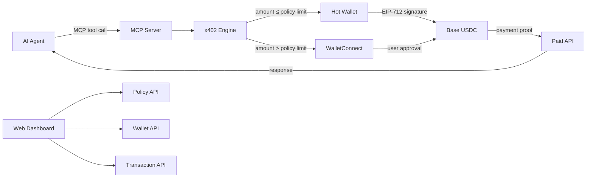

# PayMCP

An MCP server and web dashboard that enables AI agents to make [x402](https://www.x402.org/) HTTP payments on Base using USDC.


## What is this?

PayMCP is a payment gateway for AI agents. When an AI agent needs to access a paid API that uses the [x402 payment protocol](https://www.x402.org/), PayMCP handles the entire payment flow automatically: it detects HTTP 402 responses, constructs EIP-712 signatures (EIP-3009 `TransferWithAuthorization`), and retries the request with cryptographic payment proof -- all within a single MCP tool call.

Small payments are auto-signed by a server-side hot wallet. Larger payments are routed to the user's own wallet via WalletConnect for explicit approval. Spending policies enforce per-request, hourly, and daily limits, with endpoint whitelisting and blacklisting.

## Features

- **x402 Payment Engine** -- Automatic HTTP 402 payment negotiation with EIP-712 signed USDC transfers on Base
- **Tiered Signing** -- Small payments auto-signed by hot wallet; larger payments require WalletConnect approval
- **MCP Server** -- 4 tools for AI agents: `x402_pay`, `x402_check_balance`, `x402_spending_history`, `x402_check_pending`
- **Hot Wallet Management** -- Create, fund, and withdraw USDC with AES-256 encrypted key storage
- **Spending Policies** -- Configurable per-request, per-hour, and per-day limits with endpoint whitelist/blacklist
- **Pending Payment Approval** -- Dashboard UI for reviewing and approving WalletConnect-tier payments
- **Session Health Monitoring** -- Real-time WalletConnect connection status
- **Spending Analytics** -- Daily spending chart (pure SVG) with summary cards
- **Transaction History** -- Filterable list with on-chain verification via BaseScan
- **Environment-Driven Chain Config** -- Switch between Base mainnet and Base Sepolia via a single env var

## Architecture



## Quick Start

### Prerequisites

- Node.js 18+
- npm

### Setup

```bash
# Clone the repository
git clone https://github.com/marcopesani/x402-mcp-gateway.git
cd x402-mcp-gateway

# Install dependencies
npm install

# Copy environment file and configure
cp .env.example .env.local

# Generate a hot wallet encryption key
node -e "console.log(require('crypto').randomBytes(32).toString('hex'))"
# Add the output to HOT_WALLET_ENCRYPTION_KEY in .env.local

# Set up the database
npx prisma migrate deploy

# Start the development server
npm run dev
```

Open [http://localhost:3000](http://localhost:3000) to access the dashboard.

## MCP Integration

PayMCP exposes an MCP endpoint at `/api/mcp/{userId}` using [Streamable HTTP transport](https://modelcontextprotocol.io/specification/2025-03-26/basic/transports#streamable-http). Connect any MCP-compatible AI agent by pointing it to this URL.

### Tools

#### `x402_pay`

Make an HTTP request to an x402-protected URL. Automatically handles 402 payment negotiation.

```json
{
  "url": "https://api.example.com/premium-data",
  "method": "GET"
}
```

#### `x402_check_balance`

Check the hot wallet USDC balance and remaining spending budget.

```json
{}
```

Returns wallet address, USDC balance, and remaining per-request/hourly/daily budget.

#### `x402_spending_history`

Query transaction history with optional date filter.

```json
{
  "since": "2025-01-01T00:00:00Z"
}
```

#### `x402_check_pending`

Poll the status of a pending payment awaiting WalletConnect approval.

```json
{
  "paymentId": "clx..."
}
```

### Example: Claude Desktop Configuration

```json
{
  "mcpServers": {
    "paymcp": {
      "url": "http://localhost:3000/api/mcp/your-user-id"
    }
  }
}
```

## API Reference

| Method | Path | Description |
|--------|------|-------------|
| `POST` | `/api/wallet/create` | Create a new hot wallet |
| `GET` | `/api/wallet/balance` | Check hot wallet USDC balance |
| `POST` | `/api/wallet/withdraw` | Withdraw USDC to connected wallet |
| `GET` | `/api/wallet/session` | Check WalletConnect session status |
| `GET` | `/api/policy` | Get current spending policy |
| `PUT` | `/api/policy` | Update spending policy |
| `GET` | `/api/transactions` | List transaction history |
| `POST` | `/api/transactions/{id}/verify` | Verify transaction on-chain via BaseScan |
| `GET` | `/api/payments/pending` | List pending payments awaiting approval |
| `POST` | `/api/payments/{id}/approve` | Approve a pending payment |
| `POST` | `/api/payments/{id}/reject` | Reject a pending payment |
| `GET` | `/api/analytics` | Get spending analytics data |
| `POST` | `/api/mcp/{userId}` | MCP server endpoint (Streamable HTTP) |

## Testing

The project includes 174 tests across three layers.

```bash
# Run all unit and integration tests
npm test

# Run only E2E tests (requires Base Sepolia RPC access)
npm run test:e2e

# Run all tests once (no watch)
npm run test:run
```

| Layer | Tests | What is covered |
|-------|------:|-----------------|
| Unit | 77 | EIP-712 signing, x402 header parsing, payment flow logic, policy enforcement, hot wallet crypto, rate limiter |
| Integration | 57 | All 12 API routes with request/response validation |
| E2E | 40 | Full payment flow against Base Sepolia testnet with real RPC calls |

## Project Structure

```
pay-mcp/
├── src/
│   ├── app/
│   │   ├── api/
│   │   │   ├── analytics/          # Spending analytics endpoint
│   │   │   ├── mcp/[userId]/       # MCP server endpoint
│   │   │   ├── payments/           # Pending payment approval/rejection
│   │   │   ├── policy/             # Spending policy CRUD
│   │   │   ├── transactions/       # Transaction history + verification
│   │   │   └── wallet/             # Hot wallet create/balance/withdraw/session
│   │   └── dashboard/              # Web dashboard pages
│   ├── components/                 # React components (wallet, charts, policies)
│   ├── lib/
│   │   ├── mcp/                    # MCP server and tool definitions
│   │   ├── x402/                   # x402 payment engine (EIP-712, headers, types)
│   │   ├── chain-config.ts         # Environment-driven chain configuration
│   │   ├── db.ts                   # Prisma client
│   │   ├── hot-wallet.ts           # Hot wallet management + encryption
│   │   ├── policy.ts               # Spending policy enforcement
│   │   ├── rate-limit.ts           # Request rate limiting
│   │   └── walletconnect*.ts       # WalletConnect integration
│   └── test/
│       ├── e2e/                    # E2E tests (Base Sepolia)
│       └── helpers/                # Test utilities, fixtures, mock 402 server
├── prisma/
│   └── schema.prisma               # Database schema
├── vitest.config.ts                 # Test configuration
└── package.json
```

## Environment Variables

| Variable | Required | Description |
|----------|----------|-------------|
| `NEXT_PUBLIC_CHAIN_ID` | No | Chain ID: `8453` (Base mainnet, default) or `84532` (Base Sepolia) |
| `NEXT_PUBLIC_WALLETCONNECT_PROJECT_ID` | Yes | WalletConnect project ID from [dashboard.reown.com](https://dashboard.reown.com) |
| `NEXT_PUBLIC_ALCHEMY_ID` | No | Alchemy API key for enhanced RPC access |
| `RPC_URL` | No | Custom RPC URL (defaults to public Base RPC) |
| `HOT_WALLET_ENCRYPTION_KEY` | Yes | 64-character hex string for AES-256 key encryption |
| `DATABASE_URL` | No | SQLite database path (defaults to `file:./prisma/dev.db`) |

## How x402 Works

[x402](https://www.x402.org/) is an open protocol for machine-to-machine payments over HTTP:

1. A client requests a resource from a server
2. The server responds with **HTTP 402 Payment Required**, including payment requirements in a response header (amount, recipient address, network)
3. The client constructs an **EIP-3009 `TransferWithAuthorization`** message and signs it with EIP-712
4. The client retries the request with the signed payment proof in a request header
5. The server verifies the signature, submits the USDC transfer on-chain, and returns the requested resource

PayMCP automates steps 2-4 for AI agents, with configurable spending limits and tiered signing authority.

## Contributing

1. Fork the repository
2. Create a feature branch (`git checkout -b feature/my-feature`)
3. Commit your changes (`git commit -m "Add my feature"`)
4. Push to the branch (`git push origin feature/my-feature`)
5. Open a Pull Request

Please ensure all tests pass before submitting:

```bash
npm run test:run
npm run build
```

## License

This project is licensed under the MIT License. See [LICENSE](LICENSE) for details.
