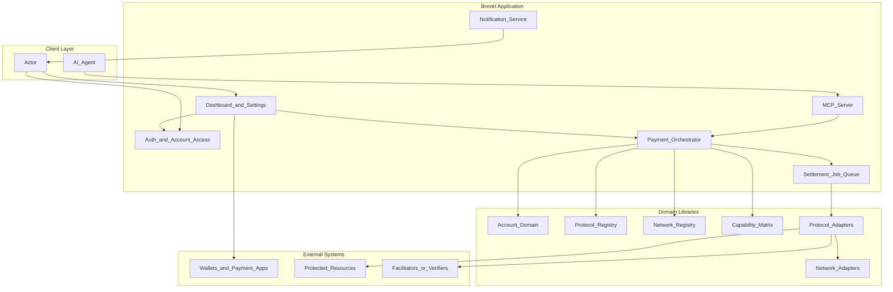

## 2. System Architecture

### 2.1 Layered architecture

### 2.2 Core architecture rules

- The web layer must never contain protocol-specific settlement logic.
- The orchestration layer owns payment lifecycle state, policy evaluation, option ranking, payment-method selection, recovery, and retries.
- All monetary comparisons must use canonical `asset_ref + amount_atomic` values. Cross-asset comparisons require explicit quote metadata that records source, currency, and timestamp.
- Budget enforcement compares the transfer amount only. Fees and total-cost metadata are stored separately for display and audit.
- Protocol adapters parse and produce protocol-specific payloads.
- Network adapters and registries describe network metadata, explorers, environments, and signing/broadcast capabilities.
- Resource-facing transfer amount and network or protocol fee amount must be modeled separately whenever they can differ.
- Any feature that depends on chain, protocol, transport, or proof format must go through a registry-driven capability check.
- Durable request and delivery records must remain transport-neutral. Transport-specific carrier details belong in versioned snapshots or metadata rather than defining the whole persistence model around HTTP-only fields.
- The account config owns payment-method priority. For any selected payment option, the first eligible active payment method in account priority order is chosen and persisted on the attempt before approval begins.
- If proof has been recorded but delivery has not completed, the system must run a recovery path before allowing any new payable attempt. Unresolved cases move to `manual_review`.
- Successful protected-resource delivery is limited to JSON response bodies; the durable envelopes remain transport-neutral.

### 2.3 End-to-end lifecycle

```mermaid
flowchart LR
    AgentReq[Agent_calls_MCP_tool] --> Probe[Probe_protected_resource]
    Probe --> Normalize[Normalize_payment_options]
    Normalize --> Filter[Filter_by_capabilities_and_budget]
    Filter --> Rank[Rank_payment_options]
    Rank --> SelectMethod[Select_first_eligible_payment_method]
    SelectMethod --> CreateReq[Create_payment_request_and_attempt]
    CreateReq --> Review[Actor_reviews_in_dashboard]
    Review --> Approve[Approve_selected_attempt]
    Approve --> Settle[Settlement_job_executes_adapter]
    Settle --> Proof[Store_proof_received]
    Proof --> Deliver[Persist_JSON_resource_response]
    Proof --> Recover[Run_delivery_recovery_if_needed]
    Recover --> ManualReview[Move_to_manual_review_if_unresolved]
```

### 2.4 x402 transport matrix

Brevet's own `/mcp` endpoint is intended to be an account-scoped orchestration API exposed by the Brevet backend (Fastify), with the MCP server implemented using the official MCP TypeScript SDK. It is not itself the x402 MCP transport. x402 transport support applies to the downstream protected resource or seller interface that Brevet probes, pays, and retries on the actor's behalf.

| Context | Brevet role | Transport contract |
|---------|-------------|--------------------|
| Agent -> Brevet MCP server | Orchestration server | Brevet-specific MCP tools `x402_pay` and `x402_payment_status` authenticated with the account API key as bearer token |
| Brevet -> downstream x402 HTTP V1 resource | x402 client | HTTP `402` with `PaymentRequirementsResponse` in the response body, `X-PAYMENT`, `X-PAYMENT-RESPONSE` |
| Brevet -> downstream x402 HTTP V2 resource | x402 client | HTTP `402` with `PAYMENT-REQUIRED`, then `PAYMENT-SIGNATURE`, `PAYMENT-RESPONSE` |
| Brevet -> downstream x402 MCP V1 resource | x402 client | Tool result `isError: true` with V1 `PaymentRequirementsResponse` in `structuredContent` and JSON text, `_meta["x402/payment"]`, `_meta["x402/payment-response"]` |
| Brevet -> downstream x402 MCP V2 resource | x402 client | Tool result `isError: true` with V2 `PaymentRequired` in `structuredContent` and JSON text, `_meta["x402/payment"]`, `_meta["x402/payment-response"]` |

Normalization rules:

- Brevet must persist the downstream transport kind and x402 version alongside normalized payment data.
- Canonical internal network references for x402 must use CAIP-2. V1 aliases such as `base` and `base-sepolia` are accepted only at the transport edge and normalized immediately.
- Raw carrier provenance must be retained so Brevet can reconstruct whether a value came from an HTTP body, HTTP header, MCP structured content, MCP text content, or MCP `_meta`.

### 2.5 Durable request and delivery envelopes

To keep the domain model transport-neutral while runtime scope remains downstream HTTP, Brevet persists generic request and delivery envelopes:

- `request_transport`, `request_target`, `request_operation`, `request_headers`, `request_body_json`, and `request_metadata` capture the original protected-resource invocation without assuming the target is always an HTTP URL.
- `payment_requirements_snapshot` preserves the raw transport-specific payment-required carrier needed for replay-safe auditability.
- `delivery_content_type`, `delivery_body_json`, and `delivery_metadata` capture successful protected-resource delivery without assuming the result will always be an HTTP-shaped record forever.
- HTTP-specific details such as status code or headers live inside delivery metadata or API projections rather than defining the durable model boundary.

---
