## 3. Domain Model

### 3.1 Terminology

- **Actor**: the human identity currently interacting with Brevet.
- **Account**: the durable container that owns resources, billing context, settings, permissions, API keys, and payment history.
- **Auth method**: a linked method that can authenticate an actor, such as an EVM SIWX wallet, passkey (WebAuthn), and email/password or OAuth later.
- **Payment method**: a linked instrument that can authorize payment on a specific network/protocol combination.
- **Payment request**: the account-scoped intent created by an agent call.
- **Payment option**: one normalized settlement path derived from a protected resource's payment requirements.
- **Payment attempt**: one concrete approval and settlement attempt against one payment option and one selected payment method.
- **Settlement receipt**: protocol-specific proof that settlement was accepted or completed.
- **Pending review**: a persisted request state meaning Brevet detected material changes during retry/requote and is waiting for explicit actor acceptance or rejection before creating a new payable attempt.
- **Manual review**: a persisted request or attempt state meaning Brevet has an unresolved lifecycle risk, such as proof receipt without successful resource delivery, and must block new payable attempts until recovery or operator action resolves the case.
- **Asset ref**: the canonical identity of a settlement asset, including its network and asset type. Two values with different `asset_ref` values must never be treated as the same money, even if they share a symbol.
- **Atomic amount**: an integer count of the smallest transferable unit for an asset, such as wei, satoshis, or token base units.
- **Display amount**: a human-readable rendering derived from `amount_atomic` plus display metadata such as symbol and decimals.
- **Quoted value**: an optional valuation of a settlement amount in a quote currency such as USD, together with the source and timestamp used to derive it.
- **Native-asset budget**: a spending limit expressed as `max_asset_ref + max_amount_atomic`.
- **Fiat budget**: a spending limit expressed as quoted fiat minor units such as USD cents, which is only enforceable when the option carries explicit quote metadata.
- **Settlement submission**: the moment Brevet submits the outbound payment payload to a resource or facilitator.
- **Proof receipt**: the moment Brevet records protocol proof that the payment was accepted or completed.
- **Resource delivery**: the moment the protected resource returns the paid response payload to Brevet.

### 3.2 Entity-relationship diagram

```mermaid
erDiagram
    actors {
        uuid id PK
        string display_name
        datetime last_seen_at
        datetime created_at
        datetime updated_at
    }

    accounts {
        uuid id PK
        string kind "personal | organization"
        string status "active | suspended | closed"
        string default_quote_currency "USD"
        datetime created_at
        datetime updated_at
    }

    account_memberships {
        uuid id PK
        uuid account_id FK
        uuid actor_id FK
        string role "owner | admin | member"
        datetime created_at
        datetime updated_at
    }

    auth_methods {
        uuid id PK
        uuid actor_id FK
        string kind "siwe_wallet | passkey | email_password | oauth | solana_wallet"
        string identifier_hash UK
        string display_identifier
        boolean can_authenticate
        boolean can_pay
        jsonb verifier_metadata
        datetime verified_at
        datetime last_used_at
        datetime created_at
        datetime updated_at
    }

    passkey_credentials {
        uuid id PK
        uuid auth_method_id FK
        string credential_id UK
        string public_key
        integer counter
        string transports
        datetime created_at
    }

    account_sessions {
        uuid id PK
        uuid account_id FK
        uuid actor_id FK
        string token_hash UK
        string ip_address
        string user_agent
        datetime expires_at
        datetime created_at
    }

    api_keys {
        uuid id PK
        uuid account_id FK
        string name
        string key_prefix
        string key_hash UK
        datetime last_used_at
        datetime created_at
        datetime revoked_at
    }

    payment_methods {
        uuid id PK
        uuid account_id FK
        uuid auth_method_id FK "nullable"
        string kind "evm_wallet | solana_wallet | lightning_wallet | lightning_node"
        string network_ref
        string environment "mainnet | testnet"
        string address_ref
        string status "active | disabled | archived"
        integer priority_rank
        jsonb capabilities
        datetime created_at
        datetime updated_at
    }

    payment_requests {
        uuid id PK
        uuid account_id FK
        uuid triggering_api_key_id FK "nullable; set when bearer access uses an account API key"
        string triggering_credential_type "api_key | session | exchanged_token | oauth_token | other"
        string triggering_credential_ref
        string triggering_subject_display
        string request_transport "http | mcp"
        string request_target
        string request_operation
        jsonb request_headers
        jsonb request_body_json
        jsonb request_metadata
        integer x402_version
        string payment_requirements_source "http_body | http_header | mcp_structured_content | mcp_text_content | mcp_meta"
        jsonb payment_requirements_snapshot
        jsonb payment_resource
        jsonb payment_extensions
        string status "pending_approval | pending_review | settling | proof_received | manual_review | settled | expired | dismissed | failed"
        string budget_kind "none | asset_native | fiat_quote"
        numeric max_amount_atomic
        string max_asset_ref
        bigint max_quote_amount_minor
        string max_quote_currency
        string idempotency_key
        string agent_request_ref
        string selected_protocol
        string selected_network_ref
        string selected_asset_ref
        string resource_host
        string description
        string review_reason
        jsonb review_payload
        string error_reason
        datetime expires_at
        datetime settled_at
        datetime failed_at
        datetime created_at
        datetime updated_at
    }

    payment_options {
        uuid id PK
        uuid payment_request_id FK
        string protocol "x402 | l402 | ln402"
        integer x402_version
        string transport_kind "http | mcp"
        string scheme
        string network_ref
        string environment "mainnet | testnet"
        string asset_ref
        string asset_symbol
        integer asset_decimals
        string recipient_ref
        numeric amount_atomic
        string display_amount
        bigint quote_amount_minor
        string quote_currency
        string quote_source
        datetime quoted_at
        string fee_asset_ref
        numeric fee_amount_atomic
        bigint total_cost_quote_amount_minor
        string proof_kind_expected
        integer ranking_score
        string option_fingerprint
        jsonb resource_info
        jsonb extension_requirements
        jsonb normalized_terms
        jsonb raw_terms
        datetime created_at
    }

    payment_attempts {
        uuid id PK
        uuid payment_request_id FK
        uuid payment_option_id FK
        uuid payment_method_id FK
        integer x402_version
        string transport_kind "http | mcp"
        integer attempt_sequence
        string approval_kind "typed_data | invoice | hosted_checkout"
        string approval_status "awaiting_user | approved | rejected | expired"
        string settlement_status "not_started | submitted | proof_received | recovery_pending | manual_review | settled | failed"
        string last_actor_action "approve | reject | dismiss | retry | review_accept | review_reject"
        string external_settlement_ref
        string facilitator_ref
        string outbound_payment_source "http_header | mcp_meta"
        jsonb accepted_terms
        jsonb resource_info
        jsonb extension_payload
        jsonb approval_payload
        jsonb settlement_payload
        jsonb protocol_request_snapshot
        string settlement_response_source "http_header | mcp_meta"
        jsonb settlement_response_payload
        string error_reason
        string actual_fee_asset_ref
        numeric actual_fee_amount_atomic
        bigint actual_total_cost_quote_amount_minor
        string delivery_content_type
        jsonb delivery_body_json
        jsonb delivery_metadata
        datetime expires_at
        datetime approved_at
        datetime submitted_at
        datetime proof_received_at
        datetime resource_delivered_at
        datetime manual_review_at
        datetime failed_at
        datetime settled_at
        datetime created_at
        datetime updated_at
    }

    settlement_receipts {
        uuid id PK
        uuid payment_attempt_id FK
        string proof_kind "tx_hash | facilitator_receipt | payment_hash | preimage | invoice_receipt"
        string proof_ref
        jsonb receipt_payload
        datetime received_at
        datetime created_at
    }

    payment_events {
        uuid id PK
        uuid payment_request_id FK
        uuid payment_attempt_id FK
        string event_type
        jsonb metadata
        datetime created_at
    }

    notification_preferences {
        uuid id PK
        uuid account_id FK
        string channel "email | push | webhook"
        string destination_ref
        boolean enabled
        datetime created_at
        datetime updated_at
    }

    actors ||--o{ account_memberships : "belongs_to"
    accounts ||--o{ account_memberships : "has"
    actors ||--o{ auth_methods : "links"
    auth_methods ||--o{ passkey_credentials : "stores_for_passkey"
    accounts ||--o{ account_sessions : "has"
    actors ||--o{ account_sessions : "opens"
    accounts ||--o{ api_keys : "owns"
    accounts ||--o{ payment_methods : "owns"
    auth_methods ||--o{ payment_methods : "may_back"
    accounts ||--o{ payment_requests : "receives"
    api_keys ||--o{ payment_requests : "may_back"
    payment_requests ||--o{ payment_options : "offers"
    payment_requests ||--o{ payment_attempts : "spawns"
    payment_options ||--o{ payment_attempts : "selected_for"
    payment_methods ||--o{ payment_attempts : "used_by"
    payment_attempts ||--o{ settlement_receipts : "produces"
    payment_requests ||--o{ payment_events : "logs"
    accounts ||--o{ notification_preferences : "configures"
```

### 3.3 Schema notes

**`actors` vs `accounts`**

An actor is the person signing in. An account is the durable business object that owns API keys, payment methods, requests, and settings. The system creates a personal account automatically at first successful SIWX auth or at first successful passkey registration (sign-up); the schema must already support many auth methods per actor and many payment methods per account.

**`auth_methods`**

An auth method is a linked login method. EVM SIWX and passkey (WebAuthn) are supported interactive auth flows. SIWX currently uses a SIWE / EIP-4361-compatible message under `eip155`; passkey uses W3C WebAuthn attestation (registration) and assertion (sign-in), with credential data stored in `passkey_credentials` when `kind = passkey`. The account model supports both so later wallet-auth or other flows can extend it without migrating the core account model. Passkey auth methods are `can_authenticate` only and do not create a payment method; wallet-linked payment methods remain SIWX-backed unless later extended. Actors can link additional auth methods after account creation via a dedicated auth methods management surface, so the same account may be accessed with any linked method (passkey, SIWX, or future methods).

**`api_keys`**

API keys are account-scoped only. They authenticate the account for MCP and are not bound to any network or environment. Only the key hash and a non-sensitive display prefix are stored.

**`payment_methods`**

A payment method is not required to be the same thing as the login method. `auth_method_id` is nullable because later flows may authenticate with email or OAuth and still pay with a wallet. `priority_rank` defines the account-wide payment-method ordering; the first compatible active method wins. `priority_rank` must be unique per account.

**`payment_requests`**

A payment request is the account-scoped aggregate created by MCP. It stores:

- the original protected-resource invocation through a transport-neutral request envelope (`request_transport`, `request_target`, `request_operation`, `request_headers`, `request_body_json`, `request_metadata`);
- the raw payment-required carrier snapshot in `payment_requirements_snapshot`;
- the triggering credential identity in generic form (`triggering_credential_type`, `triggering_credential_ref`, `triggering_subject_display`) plus the backing `triggering_api_key_id` when the bearer credential is an account API key;
- budget and idempotency inputs;
- the selected protocol/network/asset summary;
- the human-facing description; and
- any persisted review state for retry/requote via `review_reason` and `review_payload`.

`pending_option_selection` is intentionally removed from the durable status model because selection is deterministic and automatic.

**`payment_options`**

Every payment option is a normalized representation of one acceptable payment path. For x402, an option usually comes from one `accepts[]` entry. For future L402/LN402 flows, an option may represent an invoice-based route or equivalent protocol-native offer. Canonical settlement value is always represented as `asset_ref + amount_atomic`, while `asset_symbol`, `asset_decimals`, `display_amount`, quote metadata, and fee metadata are secondary fields for rendering and policy. For x402 V2, `resource_info` and `extension_requirements` preserve top-level `resource` and `extensions` data so the normalized record can reconstruct the original seller requirements.

**`payment_attempts`**

Retries create new attempts instead of mutating the original settlement attempt in place. This keeps signatures, invoice references, expiries, accepted terms, outbound payment carriers, settlement responses, failure reasons, proof-receipt timing, actual-fee facts, delivery metadata, and external settlement references auditable. `payment_method_id` is selected and persisted before approval starts. `delivery_content_type` plus `delivery_body_json` capture JSON-only delivery scope, while `delivery_metadata` holds transport-specific details such as HTTP status and headers.

**`settlement_receipts`**

Settlement proof is modeled generically and one-to-many. A successful payment may result in a transaction hash, a facilitator receipt, a Lightning payment hash, a preimage, or another protocol-native receipt. Agent-facing status APIs may project these as `payment_proofs[]` plus an optional `primary_payment_proof`.

**`x402` version and transport provenance**

For `protocol = x402`, the schema must preserve the versioned wire contract in addition to the normalized domain model.

- `x402_version` stores the downstream x402 version on the request, selected option, and attempt.
- `request_transport` / `transport_kind` distinguish downstream HTTP from downstream MCP. Brevet's own `/mcp` endpoint must not be conflated with these fields.
- `payment_requirements_source` records where the authoritative upstream requirements were read from: HTTP body, HTTP header, MCP structured content, MCP text content, or MCP `_meta`.
- `payment_requirements_snapshot` preserves the raw carrier provenance needed to reconstruct V1 body-based and V2 header-based HTTP flows, and later MCP carriers.
- `payment_resource` and `resource_info` preserve V2 `resource` objects. For V1, equivalent per-option resource identifiers must be normalized while the raw originals remain available in stored carrier snapshots.
- `payment_extensions`, `extension_requirements`, and `extension_payload` preserve V2 extension declarations and echoed client data even when Brevet does not interpret a given extension directly.
- `accepted_terms` stores the versioned outbound selection snapshot. For V2 this is the `accepted` object; for V1 this is the normalized equivalent of the chosen payment requirement entry.

**`payment_events`**

`payment_events.metadata` must include protocol, `x402_version` when applicable, downstream transport kind, carrier provenance, triggering credential summary, and protocol outcome details in addition to internal lifecycle state.

**Canonical money representation**

Settlement amounts must be represented canonically as `asset_ref + amount_atomic`.

- `asset_ref` is the durable identity of the settlement instrument and must capture enough information to distinguish assets that share a symbol but are not interchangeable, such as Base USDC vs Ethereum USDC or on-chain BTC vs Lightning BTC.
- `amount_atomic` is always an integer count of the smallest unit for the asset.
- In PostgreSQL, atomic-unit amounts should be stored in scale-zero integer-safe columns such as `numeric(78,0)` or an equivalent representation that never uses floating point.
- `asset_symbol`, `asset_decimals`, and `display_amount` are display snapshots only. They must not be used for equality, deduplication, or authorization decisions.
- Direct comparison or aggregation is valid only when `asset_ref` matches exactly.
- External API contracts that expose atomic or minor-unit amounts must use non-negative base-10 integer strings even when internal storage uses numeric or bigint columns.

**Budgets and quoted valuation**

Budgets must be explicit about whether they are asset-native or quote-based.

- `budget_kind = asset_native` means the request can be evaluated directly against `max_asset_ref + max_amount_atomic`.
- `budget_kind = fiat_quote` means the request can only be evaluated when the selected option includes `quote_amount_minor`, `quote_currency`, `quote_source`, and `quoted_at`.
- Budget enforcement compares the transfer amount only. Estimated or actual fee fields never increase the budget basis unless a later revision explicitly changes that rule.
- If no quote metadata is available for a fiat budget, the system must fail deterministically rather than guess.

**Lifecycle boundaries**

The schema distinguishes four relevant review and settlement boundaries:

- `pending_approval`: a selected option and payment method exist and are waiting for actor approval.
- `pending_review`: retry/requote detected a material change and persisted review data that requires explicit actor acceptance or rejection before a new payable attempt can be created.
- `proof_received_at`: Brevet stored protocol proof such as a tx hash or facilitator receipt.
- `manual_review`: proof exists or another uncertain side effect exists, but delivery or recovery is unresolved and new payable attempts must be blocked.

The schema also distinguishes three different settlement milestones:

- `submitted_at`: Brevet sent the outbound payment payload.
- `proof_received_at`: Brevet stored protocol proof such as a tx hash or facilitator receipt.
- `resource_delivered_at`: Brevet received and persisted the protected resource response.

`settled_at` on the request and attempt refers to the final completed state after resource delivery, not merely proof receipt.

**Network and environment invariants**

- `network_ref` and `environment` must always agree with the network registry. Impossible combinations must be rejected rather than stored.
- Payment methods, option filtering, and ranking must all enforce environment separation consistently so testnet payment methods never authorize mainnet settlement (and vice versa).

**Orchestration records vs economic events**

The current schema models orchestration facts, not a full balance ledger.

- Payment requests, options, attempts, receipts, and events are sufficient for non-custodial payment orchestration and audit trails.
- If Brevet later introduces internal balances, refunds, platform fees, or shared budget accounting, it must add append-only economic events rather than overloading orchestration tables with balance semantics.

---
