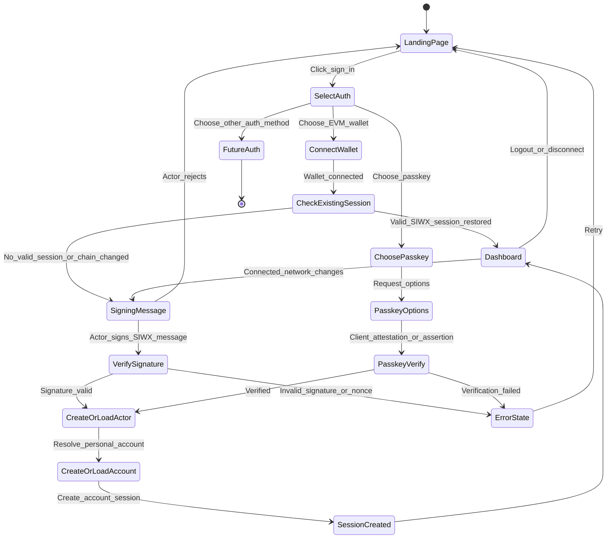
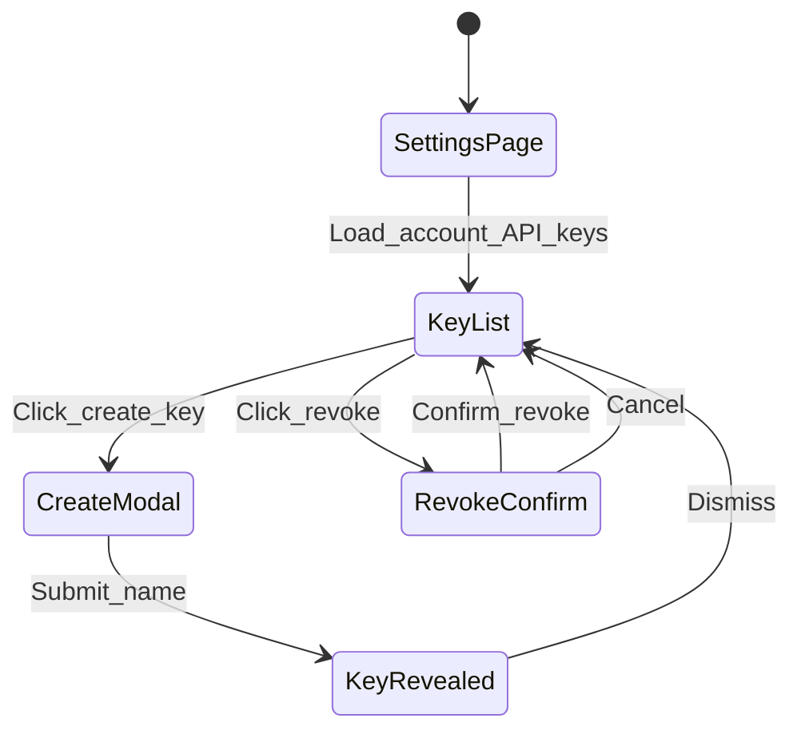
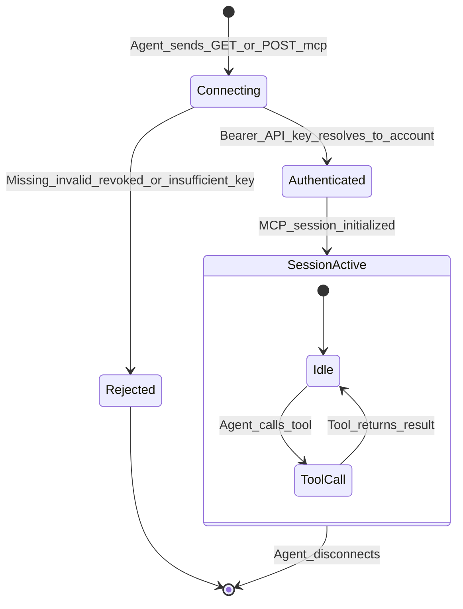
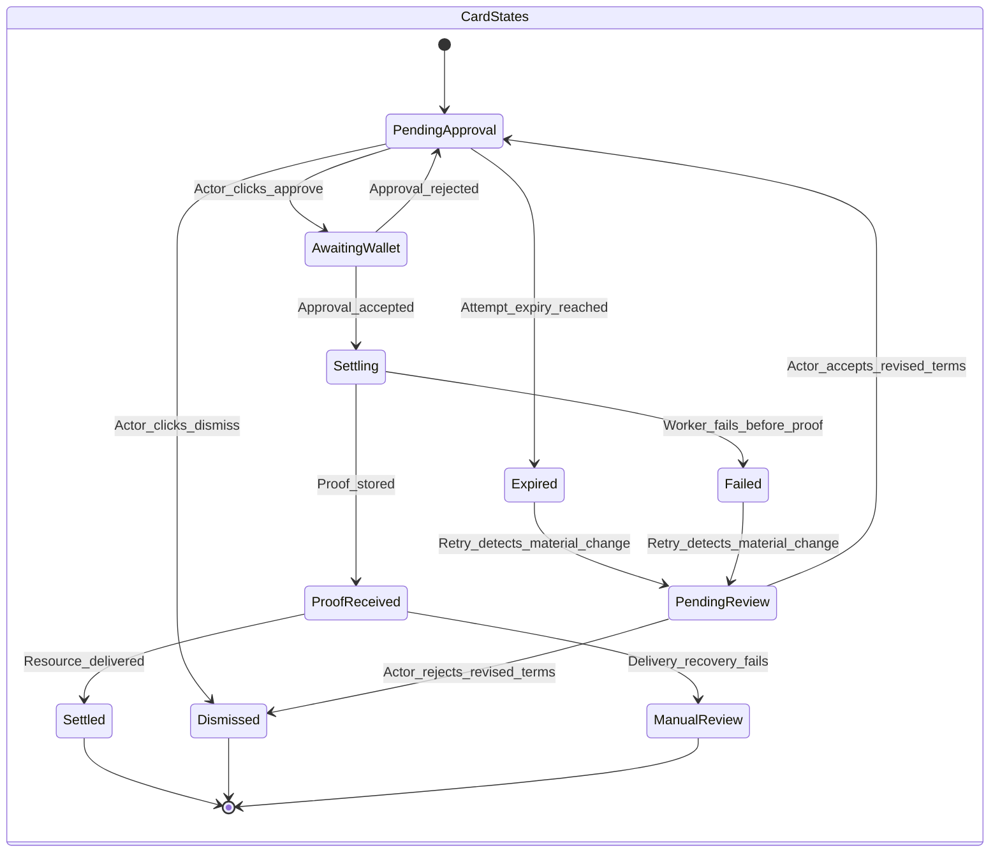
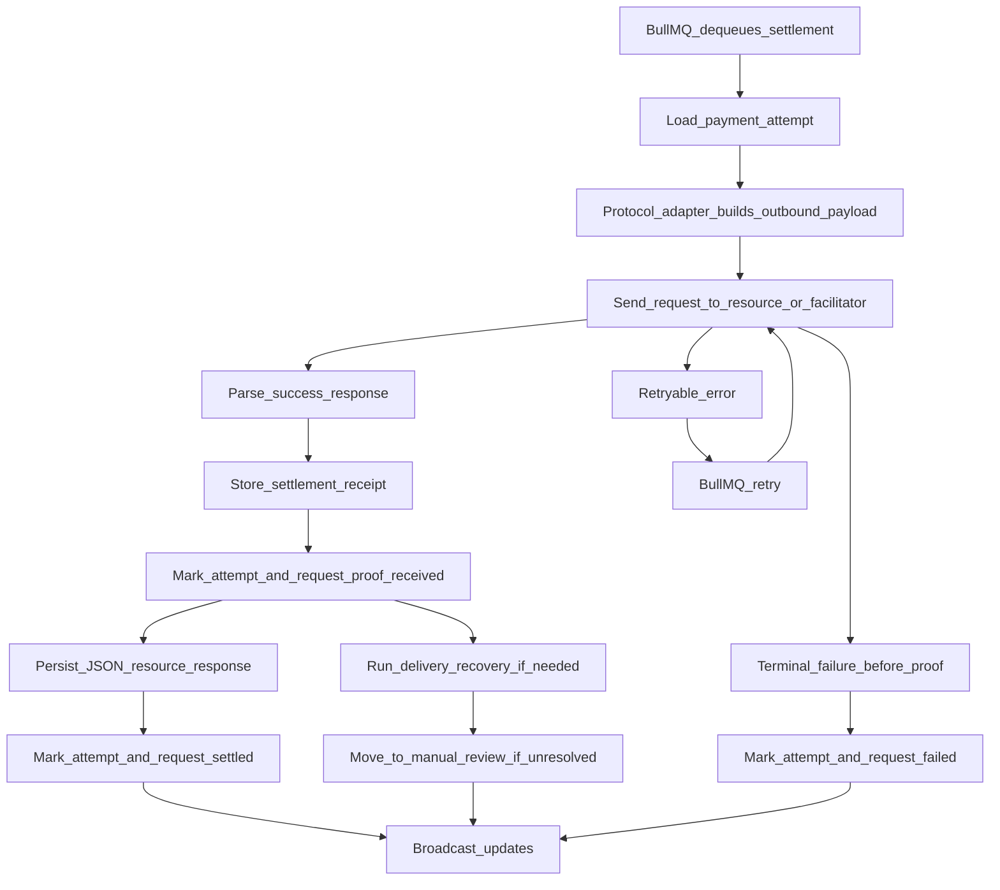
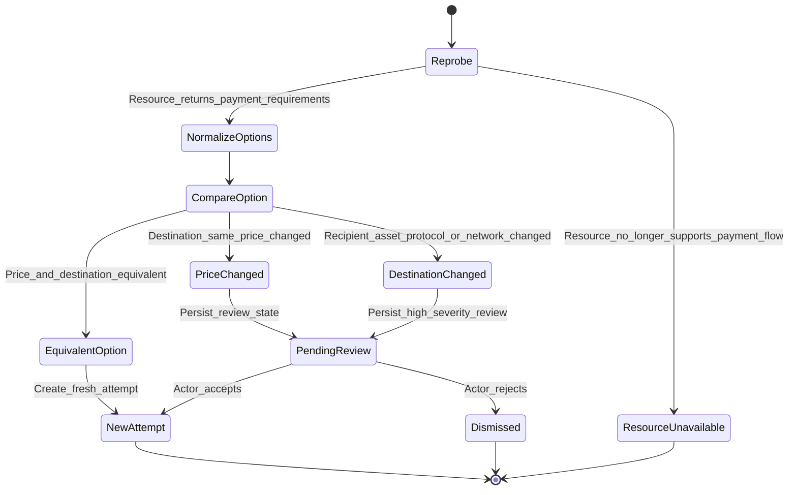
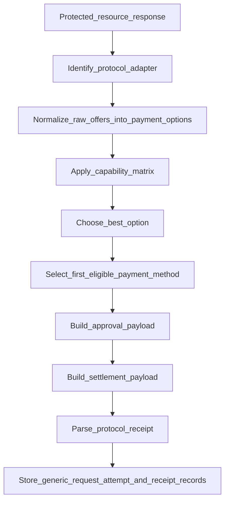

## 4. Features

### 4.1 Authentication and Account Access

#### 4.1.1 Description

Actors authenticate into Brevet using one of their linked auth methods. The system exposes EVM wallet authentication through Reown AppKit / WalletConnect using AppKit's `siwx` integration. At the product boundary, Brevet models wallet auth as SIWX (Sign In With X) aligned with CAIP-122. For the `eip155` wallet path, the signed auth message remains SIWE / EIP-4361-compatible.

For personal accounts, the first successful SIWX auth acts as sign-up: Brevet creates a personal account, creates an owner membership, links the wallet as an auth method, and also registers it as an eligible payment method for the corresponding network and environment. Later successful SIWX auth for the same actor acts as sign-in and restores access without changing the account model.

Because Brevet owns actor, account, and session policy, the primary documented integration path is self-managed SIWX through `DefaultSIWX` with Brevet-controlled components or a full custom `SIWXConfig`. `ReownAuthentication` is a valid hosted alternative when Reown-managed session storage and dashboard visibility are desired. The legacy `siweConfig` API is migration-only and must not be configured at the same time as `siwx`.

The system also supports sign-in and account creation via passkey (W3C [WebAuthn](https://passkeys.dev/docs/reference/specs/) and FIDO CTAP). Registration uses WebAuthn attestation; sign-in uses assertion. The server generates a challenge and binds it to the request (e.g. short-lived cookie or server-side store); attestation and assertion are verified server-side. On first successful passkey registration, Brevet creates the actor, a personal account, an owner membership, and an `auth_method` with `kind = passkey`; subsequent passkey authentication is sign-in and restores the same account-scoped session as SIWX. Passkey auth methods are for authentication only and do not create a payment method.

Sessions are account-scoped, store only a session-token hash at rest, and expire after 30 days of inactivity. Account status also affects access: `active` accounts have full product access, `suspended` accounts are read-only for owners/admins, and `closed` accounts do not accept new sessions.

After account creation, an actor may link additional auth methods to the same account so they can sign in with passkey, SIWX wallet, or (when supported) email/password or OAuth. The system must expose a dedicated auth methods management page (or equivalent authenticated surface) where the actor can view linked methods and add new ones; each new method must be verified (e.g. passkey attestation, SIWX signature, or password) before it is linked. This keeps the account identity unchanged regardless of which method is used to sign in.

Documented AppKit shape:

```ts
const appkit = createAppKit({
  projectId,
  networks,
  metadata,
  siwx: new DefaultSIWX() // or new ReownAuthentication()
})
```

#### 4.1.2 Flow diagram



#### 4.1.3 Functional requirements

| ID | Requirement |
|----|-------------|
| AUTH-F01 | The system must model authentication at the `actor` level and ownership at the `account` level. |
| AUTH-F02 | The system must support linking multiple auth methods to one actor, even if the UI exposes only EVM SIWX. |
| AUTH-F03 | The system must allow an actor to sign in with an EVM wallet via Reown AppKit / WalletConnect using AppKit's `siwx` integration. |
| AUTH-F04 | The product auth abstraction must be SIWX and must remain compatible with CAIP-122. For the `eip155` path, the signed auth message must remain compatible with SIWE (EIP-4361). |
| AUTH-F05 | The documented AppKit integration must use `siwx`; `siweConfig` is migration-only and must not be configured alongside `siwx`. |
| AUTH-F06 | The primary documented implementation path should be self-managed SIWX (`DefaultSIWX` with Brevet-controlled components or a full custom `SIWXConfig`) so Brevet controls message generation, verification, and session storage; `ReownAuthentication` may be offered as a hosted alternative. |
| AUTH-F07 | For the self-managed EVM SIWX path, the auth message must contain the application domain, the wallet address, a server-generated nonce, the current timestamp, and the chain ID. |
| AUTH-F08 | For the self-managed EVM SIWX path, nonces must be stored server-side with a TTL of 5 minutes and consumed exactly once. |
| AUTH-F09 | If a valid SIWX session already exists for the connected wallet and chain, the system should restore sign-in without requiring a new auth signature. |
| AUTH-F10 | If the connected network changes, the system must require a fresh auth signature before continuing authenticated use on that network. |
| AUTH-F11 | On successful SIWX verification, the system must create or load the actor, create or load a personal account, and create an owner membership if one does not exist yet. |
| AUTH-F12 | On first successful SIWX sign-in, the system must create an `auth_method` record and a corresponding `payment_method` record for the wallet and network. |
| AUTH-F13 | The system must allow multiple payment methods to be linked to a single account over time. |
| AUTH-F14 | The system must create an account-scoped session token, store only its hash, and send the raw token as a signed cookie. |
| AUTH-F15 | Logout must revoke the account session and clear the cookie. Disconnect should revoke or clear the SIWX-authenticated session by default; if optional auth is enabled later, the wallet may remain connected but unauthenticated. |
| AUTH-F16 | Base and Base Sepolia must be stored as distinct network/environment combinations and must never share the same linked payment method record. |
| AUTH-F17 | The domain model must allow future auth methods such as email/password, OAuth, and Solana wallet auth without changing the `accounts` table shape. |
| AUTH-F18 | The system must allow a wallet-linked auth method to be marked `can_authenticate`, `can_pay`, or both. |
| AUTH-F19 | The system must reject expired or replayed auth nonces. |
| AUTH-F20 | `accounts.status = active` permits normal sign-in; `suspended` permits read-only owner/admin access only; `closed` denies new sessions and must invalidate existing account sessions. |
| AUTH-F21 | For passkey registration, the server must generate WebAuthn registration options (including a challenge), and the client must perform attestation; the server must verify the attestation and store the credential (e.g. in `passkey_credentials`). The challenge must be single-use and bound to a short TTL (e.g. 5 minutes). |
| AUTH-F22 | For passkey authentication, the server must generate WebAuthn authentication options (challenge), and the client must perform assertion; the server must verify the assertion and resolve the actor, account, and session. The challenge must be single-use and bound to a short TTL. |
| AUTH-F23 | On first successful passkey registration (sign-up), the system must create the actor, a personal account, an owner membership, and an `auth_method` with `kind = passkey`; the passkey auth method must be `can_authenticate` only unless later extended for payment. |
| AUTH-F24 | On successful passkey verification (sign-in or sign-up), the system must create an account-scoped session token, store only its hash, and send the raw token as a signed cookie, in the same way as SIWX. |
| AUTH-F25 | The system must allow an actor to link a passkey as an additional auth method when already authenticated (e.g. via SIWX or another passkey). |
| AUTH-F26 | The system must provide a dedicated auth methods management page (or equivalent authenticated surface) where the actor can view the auth methods linked to their account and add new ones. Supported methods for linking must include passkey and SIWX (and, when implemented, email/password and OAuth). Adding a method must require successful verification of that method and must associate it with the same actor/account without changing account identity. |
| AUTH-F27 | The system must not allow unlinking an auth method if that would leave the account with no remaining way to sign in (e.g. require at least one linked auth method, or enforce an equivalent safeguard so the actor cannot lock themselves out). |

#### 4.1.4 Non-functional requirements

| ID | Requirement |
|----|-------------|
| AUTH-NF01 | For the self-managed EVM SIWX path, nonce generation and verification must complete within 100ms. |
| AUTH-NF02 | SIWX message and session handling must conform to CAIP-122, and the EVM auth message must remain compatible with EIP-4361. |
| AUTH-NF03 | Session tokens must be cryptographically random with at least 256 bits of entropy. |
| AUTH-NF04 | Raw session tokens must never be persisted. |
| AUTH-NF05 | Sessions must expire after 30 days of inactivity. |
| AUTH-NF06 | The auth domain layer must not assume that every actor has exactly one wallet or that every wallet belongs to exactly one account forever. |
| AUTH-NF07 | Passkey registration and authentication challenges must be single-use and expire within 5 minutes. Passkey implementation must align with W3C WebAuthn Level 2 and FIDO CTAP 2.2 (or current versions per [passkeys.dev specifications](https://passkeys.dev/docs/reference/specs/)). |

#### 4.1.5 Definition of Done

- [ ] Actor can sign in with an EVM wallet via Reown AppKit / WalletConnect using `siwx`.
- [ ] Documented self-managed AppKit integration uses `siwx`, not `siweConfig`.
- [ ] EVM auth message includes domain, wallet address, nonce, timestamp, and chain ID.
- [ ] Nonces are single-use, stored server-side, and rejected after the 5-minute TTL.
- [ ] Signature verification correctly validates the signer session for the self-managed EVM path.
- [ ] First successful SIWX auth creates actor, personal account, owner membership, auth method, and payment method with the intended `can_authenticate` and `can_pay` flags.
- [ ] Returning actor with a valid stored SIWX session is recognized without duplicating account or linked method records.
- [ ] Changing the connected network triggers re-auth before further authenticated activity.
- [ ] Account session cookie is set and validated on subsequent requests, and only the session-token hash is stored at rest.
- [ ] Session inactivity expiry is enforced after 30 days.
- [ ] Session tokens meet the 256-bit entropy requirement.
- [ ] Expired or replayed auth nonces are rejected.
- [ ] Logout revokes the account session, and disconnect clears the authenticated session.
- [ ] Suspended accounts are read-only and closed accounts cannot create new sessions.
- [ ] Domain test: one actor can link more than one auth method to the same account.
- [ ] Domain test: one account can have more than one payment method.
- [ ] Domain test: Base and Base Sepolia payment methods remain distinct.
- [ ] E2E test: full SIWX signup flow with a test wallet.
- [ ] E2E test: login flow for an existing actor/account pair using a restored or renewed SIWX session.
- [ ] First successful passkey registration (sign-up) creates actor, personal account, owner membership, and auth method with `can_authenticate` only.
- [ ] Passkey sign-in (assertion) restores account-scoped session; session cookie and hash-only storage match SIWX behavior.
- [ ] Passkey registration and authentication challenges are single-use and expire within the required TTL (e.g. 5 minutes).
- [ ] E2E or manual test: passkey sign-up and sign-in flow.
- [ ] Dedicated auth methods page (or section) is available when authenticated; actor can view linked methods and add passkey or SIWX (and other supported methods when implemented); verification is required before a new method is linked.
- [ ] Unlink is only allowed when at least one other auth method remains (or equivalent safeguard).

---

### 4.2 Account-Scoped API Key Management

#### 4.2.1 Description

Authenticated actors with sufficient permissions can create, view, and revoke API keys for the currently selected account. The account API key itself is the public bearer credential for `/mcp`.

Keys are for MCP authentication only and are not bound to any network or environment. Keys are shown in full exactly once at creation and only their hash is persisted.

#### 4.2.2 Flow diagram



#### 4.2.3 Functional requirements

| ID | Requirement |
|----|-------------|
| KEY-F01 | API keys must belong to an account, not directly to an actor or wallet. |
| KEY-F02 | Actors may create or revoke API keys only for accounts where they have sufficient membership permissions. |
| KEY-F03 | Generated keys must follow the format `sk_` followed by at least 48 random hexadecimal characters. |
| KEY-F04 | The full key must be displayed exactly once immediately after creation. |
| KEY-F05 | The system must store only the SHA-256 hash of the key and a non-sensitive display prefix. |
| KEY-F06 | Actors must be able to list active keys for the account, showing name, prefix, creation date, and last used date. |
| KEY-F07 | Revocation must be immediate for all subsequent uses of that key, including direct `/mcp` bearer access backed by the revoked key. |
| KEY-F08 | The system must update `last_used_at` asynchronously after successful key verification. |
| KEY-F09 | Accounts must be able to create multiple keys up to a configurable limit (default 10). |
| KEY-F12 | If an MCP session was initialized with a key that is later revoked, all subsequent MCP requests or tool calls backed by that key must fail. The server may also close the session proactively. |
| KEY-F13 | Key verification must resolve directly to an account context without wallet-specific assumptions. |
| KEY-F14 | Membership-role policy for key creation and revocation must be documented and enforced. |

#### 4.2.4 Non-functional requirements

| ID | Requirement |
|----|-------------|
| KEY-NF01 | Key generation must use cryptographically secure random bytes with at least 192 bits of entropy. |
| KEY-NF02 | Key verification must complete within 50ms. |
| KEY-NF03 | The key hash must be indexed for fast lookup. |
| KEY-NF04 | Raw keys must never be persisted after the creation response is returned. |

#### 4.2.5 Definition of Done

- [ ] Actor can create a new account API key with a custom name.
- [ ] The created key follows the `sk_` format with at least 48 hexadecimal characters after the prefix.
- [ ] Full key is shown once and only once after creation.
- [ ] Only the key hash and non-sensitive display prefix are persisted.
- [ ] Key list shows name, prefix, created date, and last used date.
- [ ] Actor can revoke a key with confirmation.
- [ ] Revoked key can no longer access `/mcp`.
- [ ] Already-open MCP sessions backed by a revoked key reject subsequent tool calls.
- [ ] `last_used_at` is updated asynchronously.
- [ ] Key limit is enforced.
- [ ] Unit test: key generation format and entropy.
- [ ] Unit test: verify valid key resolves the correct account.
- [ ] Unit test: verify revoked key fails.
- [ ] Unit test: verify nonexistent key fails.
- [ ] Permission test: only authorized roles can create or revoke keys.
- [ ] UI test (e.g. Playwright): create, reveal, and revoke cycle.

---

### 4.3 MCP Server and Payment Intent Creation

#### 4.3.1 Description

Brevet exposes an MCP server over streamable HTTP and intends to host that surface using the official MCP TypeScript SDK (modelcontextprotocol/typescript-sdk) integrated with the Fastify backend. The public auth contract is explicit: the account API key itself is the bearer token, and the authenticated account context is resolved directly from that key.

The system exposes two tools, `x402_pay` and `x402_payment_status`, to keep the agent interface narrow while storing all payment lifecycle data in the generic account-centric model. Downstream runtime scope is x402 over HTTP; downstream x402-over-MCP is reserved.

`x402_pay` creates or reuses a `payment_request` according to idempotency inputs, probes the downstream resource, normalizes one or more `payment_options`, filters them against account capability and budget rules, selects the best compatible option using documented deterministic ranking, selects the first eligible active payment method by account-wide priority rank, and creates a `payment_attempt` in `pending_approval`.

The tool persistence policy is explicit: authenticated calls that probe or evaluate a target and fail deterministically still persist a failed `payment_request` with `error_reason`, except `idempotency_conflict`, which returns an error without creating a new request.

#### 4.3.2 Flow diagram



#### 4.3.3 Tool: `x402_pay`

**Description:** The agent asks Brevet to pay for an x402-protected resource on behalf of the authenticated account.

**Input schema:**

| Parameter | Type | Required | Description |
|-----------|------|----------|-------------|
| `url` | string | yes | HTTPS URL of the x402-protected resource. |
| `method` | string | no | HTTP method. Default: `GET`. Allowed: `GET`, `POST`, `PUT`, `DELETE`. |
| `payload` | object | no | JSON request body for `POST` or `PUT`. |
| `headers` | object | no | Additional request headers after outbound safety filtering. |
| `idempotency_key` | string | no | Client-supplied key used to deduplicate retried tool calls for the same account. |
| `agent_request_ref` | string | no | Optional agent-side correlation reference stored for auditability. |
| `budget_kind` | string | no | `none`, `asset_native`, or `fiat_quote`. Default: `none`. |
| `max_amount_atomic` | string | no | Maximum atomic-unit amount when `budget_kind` is `asset_native`. Must be a non-negative base-10 integer string. |
| `max_asset_ref` | string | no | Canonical asset identifier paired with `max_amount_atomic`. |
| `max_quote_amount_minor` | string | no | Maximum quote-currency amount in minor units when `budget_kind` is `fiat_quote`. Must be a non-negative base-10 integer string. |
| `max_quote_currency` | string | no | Quote currency for `max_quote_amount_minor`. Default: `USD`. |
| `preferred_networks` | array[string] | no | Ordered list of acceptable network references, such as `eip155:8453` or `eip155:84532`. |
| `environment` | string | no | Preferred environment: `mainnet`, `testnet`, or `any`. Default: `any`. |

**Output schema (success):**

| Field | Type | Description |
|-------|------|-------------|
| `payment_request_id` | string | UUID of the created payment request. |
| `payment_attempt_id` | string | UUID of the created payment attempt. |
| `status` | string | Always `pending_approval` on success. |
| `approval_status` | string | Always `awaiting_user` on first successful creation. |
| `settlement_status` | string | Always `not_started` on first successful creation. |
| `protocol` | string | Selected protocol, initially `x402`. |
| `x402_version` | integer | Downstream x402 version selected for the request. |
| `transport_kind` | string | Downstream x402 transport, initially `http`. |
| `network_ref` | string | Selected network reference, such as `eip155:8453`. |
| `environment` | string | `mainnet` or `testnet`. |
| `asset_ref` | string | Canonical identity of the selected settlement asset. |
| `amount_atomic` | string | Required transfer amount in atomic units. |
| `asset_symbol` | string | Display symbol snapshot for the selected asset. |
| `asset_decimals` | integer | Display decimal precision snapshot for the selected asset. |
| `display_amount` | string | Human-readable amount derived from `amount_atomic`. |
| `quote_amount_minor` | string/null | Optional quote-currency valuation of the transfer amount. |
| `quote_currency` | string/null | Quote currency for `quote_amount_minor`. |
| `total_cost_quote_amount_minor` | string/null | Optional quote-currency total cost including any known fee estimate. |
| `resource` | string | Hostname of the protected resource. |
| `description` | string | Description derived from payment requirements. |

**Error cases:**

| Error | When |
|-------|------|
| `budget_exceeded` | The selected option exceeds the supplied asset-native or quote-based transfer budget. |
| `budget_quote_unavailable` | A fiat budget was supplied, but no deterministic quote metadata was available to evaluate the selected option. |
| `not_payment_protected` | The resource did not return payment requirements. |
| `request_failed` | Brevet could not reach the resource or the outbound safety policy rejected the request. |
| `account_payment_method_missing` | The account has no compatible active payment method for the compatible options. |
| `unsupported_payment_option` | Payment options were returned, but none matched the supported protocol, network, or environment. |
| `unsupported_x402_extension` | The downstream resource declared an x402 extension Brevet could not honor safely. |
| `idempotency_conflict` | The same `idempotency_key` was reused with materially different inputs. |

#### 4.3.4 Tool: `x402_payment_status`

**Description:** The agent polls the status of a previously requested payment.

**Input schema:**

| Parameter | Type | Required | Description |
|-----------|------|----------|-------------|
| `payment_request_id` | string | yes | UUID of the payment request. |

**Output schema:**

| Field | Type | Description |
|-------|------|-------------|
| `payment_request_id` | string | UUID of the payment request. |
| `payment_attempt_id` | string/null | UUID of the latest attempt, if present. |
| `status` | string | `pending_approval`, `pending_review`, `settling`, `proof_received`, `manual_review`, `settled`, `expired`, `dismissed`, or `failed`. |
| `approval_status` | string/null | `awaiting_user`, `approved`, `rejected`, or `expired` for the latest attempt. |
| `last_actor_action` | string/null | Latest actor-visible action such as `approve`, `reject`, `dismiss`, `review_accept`, or `review_reject`. |
| `settlement_status` | string/null | `not_started`, `submitted`, `proof_received`, `recovery_pending`, `manual_review`, `settled`, or `failed` for the latest attempt. |
| `protocol` | string/null | Selected protocol. |
| `x402_version` | integer/null | x402 version used by the selected attempt, when applicable. |
| `transport_kind` | string/null | Downstream transport used by the selected attempt, such as `http` or `mcp`. |
| `network_ref` | string/null | Selected network reference. |
| `environment` | string/null | `mainnet` or `testnet`. |
| `asset_ref` | string/null | Canonical identity of the selected settlement asset. |
| `amount_atomic` | string/null | Transfer amount for the selected option in atomic units. |
| `asset_symbol` | string/null | Display symbol snapshot. |
| `asset_decimals` | integer/null | Display decimal precision snapshot. |
| `display_amount` | string/null | Human-readable amount. |
| `quote_amount_minor` | string/null | Optional quote-currency valuation of the transfer amount. |
| `quote_currency` | string/null | Quote currency for `quote_amount_minor`. |
| `total_cost_quote_amount_minor` | string/null | Optional quote-currency total cost including any known fee estimate. |
| `resource` | string | Hostname of the resource. |
| `response_content_type` | string/null | Content type of the delivered protected-resource response. |
| `response_status_code` | integer/null | HTTP status of the delivered protected-resource response when applicable. |
| `response_headers` | object/null | HTTP response headers when retained and applicable. |
| `response_body` | object/null | JSON protected-resource response when retained and settlement succeeded. |
| `response_retained` | boolean | `false` when the delivery body was nullified by retention policy or was never stored. |
| `settlement_response` | object/null | Parsed structured settlement response, such as x402 `SettlementResponse`, when provided by the downstream protocol on success or failure. |
| `settlement_response_source` | string/null | Carrier used to obtain `settlement_response`, such as `http_header` or `mcp_meta`. |
| `payment_proofs` | array[object] | Generic proof objects, such as `{kind, ref}`. |
| `primary_payment_proof` | object/null | Preferred proof object for summary display, if one exists. |
| `review_reason` | string/null | Persisted reason why the request is in `pending_review`, when applicable. |
| `error_reason` | string/null | Human-readable error message. |
| `created_at` | string | ISO 8601 timestamp. |
| `proof_received_at` | string/null | ISO 8601 timestamp for proof receipt. |
| `settled_at` | string/null | ISO 8601 timestamp. |

#### 4.3.5 Functional requirements

| ID | Requirement |
|----|-------------|
| MCP-F01 | The MCP server must be available at `GET /mcp` and `POST /mcp` using MCP streamable HTTP transport. The intended implementation uses the official MCP TypeScript SDK for MCP streamable HTTP, integrated with the Fastify backend. |
| MCP-F02 | Every MCP request must use Bearer authorization semantics; the bearer credential is the account API key itself: `Authorization: Bearer <account_api_key>`. |
| MCP-F03 | Missing, invalid, revoked, expired, or insufficient bearer credentials must return HTTP 401 with JSON error details plus MCP-compatible protected resource metadata discovery information. Successfully authenticated requests must resolve directly to an account context. |
| MCP-F04 | The system must expose exactly two tools: `x402_pay` and `x402_payment_status`. |
| MCP-F05 | `x402_pay` must probe the target URL with the specified method, JSON payload, and filtered headers, subject to the outbound safety policy. |
| MCP-F06 | When the target returns payment requirements, the system must normalize each acceptable payment path into a `payment_option` whose canonical settlement value is `asset_ref + amount_atomic`, with display, quote, and fee metadata stored separately. |
| MCP-F07 | The system must filter options by protocol support, network support, request environment filter, account status, active linked payment methods, and the ability to evaluate any supplied budget deterministically. Disabled or archived payment methods are never eligible. |
| MCP-F08 | The system must select the highest-ranked compatible option using one ordered deterministic policy: earlier `preferred_networks` entries win when supplied; then exact environment matches win; then lower adapter `ranking_score` wins; then lower transfer `amount_atomic` wins when `asset_ref` matches; then lower `quote_amount_minor` wins when deterministic quote comparison is required; final ties are broken by lexicographically smallest `option_fingerprint`. |
| MCP-F09 | After selecting an option, the system must select the first eligible active payment method by ascending account `priority_rank`, persist it on the attempt before approval starts, and treat that selection as fixed for dashboard approval. |
| MCP-F10 | If `budget_kind = asset_native`, the selected option must match `max_asset_ref` exactly and the transfer amount must not exceed `max_amount_atomic`. If `budget_kind = fiat_quote`, the selected option must include compatible quote metadata in the requested `max_quote_currency`, and the transfer quote amount must not exceed `max_quote_amount_minor`; otherwise the tool must return `budget_quote_unavailable` or `budget_exceeded`. |
| MCP-F11 | Authenticated `x402_pay` calls that complete probe or option evaluation and end in `not_payment_protected`, `request_failed`, `budget_exceeded`, `budget_quote_unavailable`, `account_payment_method_missing`, `unsupported_payment_option`, or `unsupported_x402_extension` must persist a failed `payment_request` with `error_reason` and no pending attempt. `idempotency_conflict` must not create a new request. |
| MCP-F12 | The tool must create a `payment_request` and a `payment_attempt`, or return the existing request idempotently when the same `idempotency_key` is retried with materially identical inputs. |
| MCP-F13 | `x402_payment_status` must return only requests belonging to the authenticated account. |
| MCP-F14 | The payment request must record the triggering credential identity for auditability using generic credential fields. When the authenticated bearer access is backed by an account API key, the corresponding `triggering_api_key_id` must also be recorded. Any supplied `idempotency_key` or `agent_request_ref` must be persisted. |
| MCP-F15 | The MCP layer must not require a 1:1 mapping between account and wallet. |
| MCP-F16 | Base and Base Sepolia must both be supported in the ranking and compatibility logic. |
| MCP-F17 | Reusing an `idempotency_key` with materially different inputs must fail deterministically with `idempotency_conflict`. |
| MCP-F18 | `x402_payment_status` must expose `proof_received` separately from final `settled` completion when those stages do not coincide. |
| MCP-F19 | If a fiat budget is used for selection, the chosen quote amount, quote currency, quote source, and quote timestamp must be recorded for auditability. |
| MCP-F20 | Brevet's `/mcp` API must remain distinct from downstream x402 MCP transport semantics. Downstream x402 transport selection belongs to the adapter layer and must not leak into the agent-facing tool contract. |
| MCP-F21 | For x402 HTTP V1, the parser must accept a `402` body `PaymentRequirementsResponse`, V1 network aliases such as `base` and `base-sepolia`, `maxAmountRequired`, and settlement results from `X-PAYMENT-RESPONSE`. |
| MCP-F22 | For x402 HTTP V2, the parser must accept `PAYMENT-REQUIRED`, top-level `resource`, V2 `amount`, optional `extensions`, and settlement results from `PAYMENT-RESPONSE`. |
| MCP-F23 | The system must preserve V2 `resource`, `accepted`, and `extensions` objects end-to-end for auditability and replay-safe retries. |
| MCP-F24 | If server-declared V2 extensions can be forwarded safely but are otherwise unsupported, the system must preserve and echo them unchanged; if Brevet cannot satisfy an extension's required semantics safely, the tool must fail with `unsupported_x402_extension`. |
| MCP-F25 | `x402_payment_status` must expose parsed structured settlement responses on both success and failure whenever the downstream protocol provides them. |
| MCP-F26 | Internal canonical network references must normalize V1 aliases to CAIP-2 refs without conflating them with the V2 wire format. |
| MCP-F27 | All external atomic and minor-unit monetary fields in MCP tool contracts must be non-negative base-10 integer strings. |
| MCP-F28 | `x402_payment_status` must expose `approval_status` and `last_actor_action` so an agent can distinguish waiting-for-user from user-rejected. |
| MCP-F29 | `x402_payment_status` must expose `payment_proofs[]` and may additionally expose `primary_payment_proof`. |
| MCP-F30 | Successful protected-resource delivery supports JSON responses only. `x402_payment_status` must expose `response_content_type`, `response_body`, and `response_retained` accordingly. |
| MCP-F31 | After delivery nullification by retention policy, `x402_payment_status` must return `response_body = null`, `response_headers = null`, and `response_retained = false` while preserving proof and audit metadata. |
| MCP-F32 | `x402_pay` is allowed only for `accounts.status = active`. `suspended` accounts may use `x402_payment_status` for existing requests but may not create new payment requests. `closed` accounts must fail authentication because their MCP credentials are invalidated. |
| MCP-F33 | Request and attempt expiry must be set to the earliest of downstream requirement expiry, approval-payload expiry, or 15 minutes after attempt creation when neither upstream value exists. If approval arrives after expiry, the server must reject it and must not enqueue settlement. |

#### 4.3.6 Non-functional requirements

| ID | Requirement |
|----|-------------|
| MCP-NF01 | The MCP endpoint must support concurrent agent connections for the same account. |
| MCP-NF02 | Probe requests to protected resources must timeout after 30 seconds. |
| MCP-NF03 | `x402_payment_status` must respond within 100ms for a simple status lookup. |
| MCP-NF04 | The system must handle at least 1,000 concurrent MCP sessions. |
| MCP-NF05 | The MCP server must target interoperable MCP streamable HTTP behavior through the selected runtime. The exact dated MCP revision supported by a deployed build must be documented with that runtime rather than hard-coded here as a product gate. |
| MCP-NF06 | Idempotent retries must not create duplicate payment requests or duplicate pending attempts. |
| MCP-NF07 | Budget evaluation, ranking, payment-method selection, and quote comparison must not use floating-point arithmetic. |

#### 4.3.7 Definition of Done

- [ ] MCP server accepts account-scoped connections at `/mcp` through the selected MCP runtime.
- [ ] The bearer credential used for `/mcp` is the account API key itself.
- [ ] Unauthenticated MCP request returns `401` with a Bearer challenge and protected resource metadata guidance.
- [ ] Invalid, revoked, or otherwise insufficient bearer credential returns `401`.
- [ ] If an API key is revoked after a session starts, subsequent MCP tool calls backed by that key are rejected.
- [ ] `x402_pay` with a valid x402 URL creates a `payment_request` and `payment_attempt`, or reuses the existing request when retried with the same `idempotency_key`.
- [ ] `x402_pay` records the selected `x402_version`, downstream `transport_kind`, triggering credential identity, and selected payment method.
- [ ] Probe results are normalized into `payment_options` with canonical `asset_ref` and `amount_atomic` fields before ranking.
- [ ] Deterministic ranking and payment-method selection produce the same result for identical inputs, including final tie-breaks.
- [ ] x402 HTTP V1 parsing accepts a `402` body `PaymentRequirementsResponse`, `maxAmountRequired`, and V1 network aliases.
- [ ] x402 HTTP V2 parsing accepts `PAYMENT-REQUIRED`, top-level `resource`, `amount`, and optional `extensions`.
- [ ] `x402_pay` with a non-payment-protected URL returns `not_payment_protected` and persists a failed `payment_request` with a reason.
- [ ] `x402_pay` with an asset-native or fiat budget below the selected option returns `budget_exceeded` and persists a failed `payment_request`.
- [ ] `x402_pay` with a fiat budget and no deterministic quote metadata returns `budget_quote_unavailable` and persists a failed `payment_request`.
- [ ] `x402_pay` returns `unsupported_x402_extension` when a required extension cannot be honored safely.
- [ ] Reusing the same `idempotency_key` with materially different inputs returns `idempotency_conflict` without creating a new request.
- [ ] `x402_payment_status` returns the correct status for each lifecycle state, including `proof_received` and `manual_review`.
- [ ] `x402_payment_status` exposes `approval_status`, `last_actor_action`, `payment_proofs[]`, `primary_payment_proof`, and structured settlement response data when available.
- [ ] `x402_payment_status` returns `response_retained = false` after delivery data has been nullified by retention policy.
- [ ] `x402_payment_status` rejects access to requests belonging to another account.
- [ ] Probe timeout is enforced at 30 seconds.
- [ ] Simple status lookup meets the 100ms target.
- [ ] Load test demonstrates 1,000 concurrent MCP sessions.
- [ ] Integration test: agent creates payment, actor approves, and agent polls successfully.

---

### 4.4 Payment Approval Dashboard

#### 4.4.1 Description

The dashboard shows active payment requests for the selected account. Each card summarizes the selected option, including display amount, asset symbol, protocol, network, environment, recipient, resource description, the triggering credential identity, any backing API key when relevant, and the auto-selected payment method. When quote or fee metadata is available, the card must separate the transfer amount from estimated or actual total cost.

Brevet distinguishes wallet authentication from payment approval. The SIWX auth signature establishes or restores the actor's authenticated session in Brevet. The x402 payment approval signature is a separate wallet action bound to a specific `payment_attempt`.

Approval is protocol-aware. For x402 on EVM, approval triggers a separate `signTypedData` request through the connected AppKit / WalletConnect session after the actor is already authenticated. The dashboard does not allow override of the selected payment method: it displays the method chosen by account priority and asks the actor to approve that exact attempt.

#### 4.4.2 Flow diagram



#### 4.4.3 Functional requirements

| ID | Requirement |
|----|-------------|
| DASH-F01 | The dashboard must display active payment requests for the authenticated account. |
| DASH-F02 | Each card must show display amount, asset symbol, protocol, network, environment, recipient hostname or recipient ref, resource description, triggering credential identity, backing API key when relevant, selected payment method, creation time, and expiry countdown. |
| DASH-F03 | The UI must render the approval control appropriate to the `approval_kind` of the selected attempt. |
| DASH-F04 | Approval for x402 on EVM must trigger a payment-specific `signTypedData` request via WalletConnect after the actor is already authenticated. |
| DASH-F05 | If the actor rejects approval in the payment app, the request must remain `pending_approval`, the attempt must record `approval_status = rejected`, and `last_actor_action = reject`. |
| DASH-F06 | The actor must be able to dismiss any request in `pending_approval`, `expired`, or `failed` state. |
| DASH-F07 | New requests must appear on the dashboard without page refresh. |
| DASH-F08 | State changes must propagate to all open account dashboards without page refresh. |
| DASH-F09 | Settled requests must show a generic proof summary and, when the proof is a transaction hash, link to the network explorer. |
| DASH-F10 | The dashboard must clearly distinguish Base from Base Sepolia in all approval and settled states. |
| DASH-F11 | The dashboard must show an empty state when the account has no active requests. |
| DASH-F12 | The dashboard must work on mobile browsers. |
| DASH-F13 | When fee or quote metadata is available, the dashboard must show transfer amount separately from estimated or actual total cost. |
| DASH-F14 | The dashboard must distinguish `settling`, `proof_received`, `settled`, and `manual_review` when those lifecycle stages occur separately. |
| DASH-F15 | x402 payment approval must be initiated by the dashboard/webapp over an active AppKit / WalletConnect session; the backend must not assume it can directly push arbitrary payment requests to the wallet without the web client as request initiator. |
| DASH-F16 | The dashboard must show which payment method was auto-selected by account priority and must not allow override. |
| DASH-F17 | When more than one eligible payment method exists, the dashboard must show the chosen method and make clear that selection followed the account priority configuration. |
| DASH-F18 | The dashboard must enforce status behavior consistently: `active` accounts may approve or dismiss; `suspended` accounts are read-only and cannot approve or retry; `closed` accounts cannot access the dashboard. `disabled` and `archived` payment methods are never eligible for new approvals. |
| DASH-F19 | When retry/requote creates a persisted `pending_review` state, the dashboard must show the reason, the before/after terms, and explicit accept/reject actions. |

#### 4.4.4 Non-functional requirements

| ID | Requirement |
|----|-------------|
| DASH-NF01 | PubSub-driven UI updates must appear within 500ms of the underlying state change. |
| DASH-NF02 | Initial dashboard render must complete within 1 second. |
| DASH-NF03 | The approval modal or payment-app handoff must start within 2 seconds of clicking approve. |
| DASH-NF04 | The dashboard must work on the latest two versions of Chrome, Firefox, Safari, and their mobile equivalents. |

#### 4.4.5 Definition of Done

- [ ] Dashboard loads and shows active payment requests for the current account.
- [ ] New request cards appear in real time when an agent creates one.
- [ ] Each card shows display amount, asset symbol, selected payment method, triggering identity, backing API key when relevant, and expiry countdown.
- [ ] Approval button starts the correct approval flow for the selected attempt within 2 seconds.
- [ ] x402 approval triggers a separate WalletConnect `signTypedData` request after auth.
- [ ] If the actor signs before expiry, the attempt transitions to `settling` and a settlement job is enqueued exactly once.
- [ ] If the actor rejects in the wallet, the request remains `pending_approval` and the attempt records `approval_status = rejected`.
- [ ] If approval arrives after expiry, the server rejects it and does not enqueue settlement.
- [ ] When proof is stored before delivery completes, the card transitions to `proof_received`.
- [ ] If delivery recovery fails after proof receipt, the card transitions to `manual_review`.
- [ ] After settlement, the card transitions to `settled` and shows proof details.
- [ ] If proof kind is `tx_hash`, the card links to the correct block explorer.
- [ ] Dismiss removes the card and updates request status.
- [ ] Base and Base Sepolia are visually distinct in the UI.
- [ ] Empty state is shown when no active requests exist.
- [ ] Suspended accounts are read-only in the dashboard.
- [ ] Mobile-browser support works on the latest two versions of supported browsers.
- [ ] Documentation does not claim Brevet can directly push arbitrary payment requests from the backend to the wallet without the dashboard/webapp as initiator.
- [ ] UI/browser test: real-time or poll-driven payment card updates.
- [ ] Pending-review cards show before/after terms and explicit accept/reject controls.

---

### 4.5 Settlement Orchestration

#### 4.5.1 Description

After the actor approves a payment attempt, a BullMQ settlement job performs settlement. The worker loads the attempt, delegates protocol-specific payload construction to the selected protocol adapter, submits the request to the protected resource or facilitator, parses the result, stores one or more settlement receipts, stores any successful protected-resource response, and updates the account-visible lifecycle state one milestone at a time.

For x402 on EVM, the worker selects the correct transport codec from the persisted `x402_version` and `transport_kind`. HTTP V1 flows build `X-PAYMENT` and parse `X-PAYMENT-RESPONSE`. HTTP V2 flows build `PAYMENT-SIGNATURE` and parse `PAYMENT-RESPONSE`. Downstream x402-over-MCP is reserved.

If proof has been received but resource delivery fails or cannot be parsed as supported JSON, the system must not allow a new payable attempt immediately. It must first run recovery using the stored proof or settlement response. If recovery does not resolve delivery, the request and attempt move to `manual_review`.

#### 4.5.2 Flow diagram



#### 4.5.3 Functional requirements

| ID | Requirement |
|----|-------------|
| BCAST-F01 | Approval of a payment attempt must enqueue a BullMQ settlement job. |
| BCAST-F02 | The settlement worker must be selected by protocol, x402 version when applicable, downstream transport kind, and network metadata from the chosen payment option. |
| BCAST-F03 | The protocol adapter must build the outbound settlement payload from the generic attempt plus protocol-specific approval data, preserved accepted terms, and canonical settlement amount fields. |
| BCAST-F04 | For x402 HTTP V1, the worker must build a valid `X-PAYMENT` payload containing the V1 `PaymentPayload`. |
| BCAST-F05 | For x402 HTTP V2, the worker must build a valid `PAYMENT-SIGNATURE` payload containing the V2 `PaymentPayload`, including `resource`, `accepted`, and any required `extensions`. |
| BCAST-F06 | For downstream x402 MCP V1 and V2, the worker must build `_meta["x402/payment"]` using the matching versioned `PaymentPayload` schema. |
| BCAST-F07 | The worker must send the original protected-resource request with the protocol-required payment carrier and record `submitted_at` when outbound settlement begins. |
| BCAST-F08 | The worker must parse `X-PAYMENT-RESPONSE`, `PAYMENT-RESPONSE`, or `_meta["x402/payment-response"]` according to the selected version and transport, and must persist the structured settlement response on both success and failure. |
| BCAST-F09 | On the success path, the worker must store one or more settlement receipts, record `proof_received_at`, and advance the request and attempt lifecycle to `proof_received` before final completion when those stages are distinct. |
| BCAST-F10 | The worker must store successful protected-resource delivery content type and JSON body on the attempt, record `resource_delivered_at`, and mark the request and attempt `settled` only after resource delivery is persisted. |
| BCAST-F11 | If proof has been recorded and delivery fails, cannot be parsed as JSON, or otherwise remains unresolved, the system must enter `recovery_pending`, attempt delivery recovery using the stored proof or settlement response, and move to `manual_review` if recovery does not succeed. |
| BCAST-F12 | On terminal failure before proof exists, the worker must update the request and attempt state with a human-readable `error_reason` and record `failed_at`. |
| BCAST-F13 | On transient errors such as network timeout or retryable upstream failure, the worker must retry up to three times with exponential backoff. |
| BCAST-F14 | Every state transition must be appended to `payment_events` with protocol, version, transport, and outcome metadata. |
| BCAST-F15 | Every state transition must be broadcast through PubSub. |
| BCAST-F16 | The worker must be able to store proof kinds other than `tx_hash`, even if runtime commonly stores `tx_hash` plus facilitator receipt. |
| BCAST-F17 | The worker must persist external settlement references or facilitator references whenever upstream systems provide them. |
| BCAST-F18 | The worker must persist actual fee or total-cost metadata on attempt-level fields whenever the protocol or network adapter can provide it without guesswork. |
| BCAST-F19 | For side-effectful downstream requests, settlement retry must only re-submit when Brevet has a valid idempotency strategy such as a stored `idempotency_key`, x402 `payment-identifier` extension data, or an equivalent transport-specific deduplication guarantee. |
| BCAST-F20 | V2 extensions declared by the resource must be echoed or rejected according to the extension's rules; they must never be silently dropped between approval and settlement. |
| BCAST-F21 | Successful resource delivery supports JSON responses only. Non-JSON delivery after proof receipt must enter the recovery/manual-review path rather than triggering a fresh payable attempt. |
| BCAST-F22 | Approving the same attempt more than once must not enqueue duplicate settlement jobs or create duplicate economic side effects. |

#### 4.5.4 Non-functional requirements

| ID | Requirement |
|----|-------------|
| BCAST-NF01 | Each settlement attempt must timeout after 60 seconds per job attempt. |
| BCAST-NF02 | Retry backoff must be 5s, 15s, and 45s. |
| BCAST-NF03 | Settlement workers must be idempotent. Re-running a `proof_received` or `settled` attempt must not create duplicate receipts or duplicate resource responses. |
| BCAST-NF04 | The system must process at least 100 concurrent settlement jobs. |
| BCAST-NF05 | Settlement-stage updates, fee persistence, and quote comparisons must not use floating-point arithmetic. |

#### 4.5.5 Definition of Done

- [ ] Approving an attempt enqueues a settlement worker job exactly once.
- [ ] Settlement worker is selected using protocol, version, transport, and network metadata.
- [ ] Worker builds the correct outbound payment payload.
- [ ] Worker builds `X-PAYMENT` for x402 HTTP V1 and `PAYMENT-SIGNATURE` for x402 HTTP V2.
- [ ] Worker builds `_meta["x402/payment"]` for downstream x402 MCP flows.
- [ ] Worker sends the request with the correct protocol payment carrier.
- [ ] Worker records `submitted_at` when the outbound settlement request is sent.
- [ ] Worker parses and stores structured settlement responses from `X-PAYMENT-RESPONSE` or `PAYMENT-RESPONSE` on both success and failure.
- [ ] On proof receipt, request and attempt can be marked `proof_received`.
- [ ] On success, request and attempt are marked settled only after JSON resource delivery is stored.
- [ ] On success, at least one settlement receipt is stored.
- [ ] On success, response content type, JSON body, and any available actual-fee fields are stored on the attempt.
- [ ] On failure before proof, request and attempt are marked failed with an attempt-level `error_reason`.
- [ ] If proof exists but delivery fails, the system runs recovery first and moves to `manual_review` if recovery does not succeed.
- [ ] Side-effectful retries only proceed when an explicit idempotency strategy exists.
- [ ] V2 extension data is echoed or rejected deterministically rather than silently dropped.
- [ ] Retry logic uses a 60-second per-attempt timeout and 5s / 15s / 45s backoff.
- [ ] PubSub broadcasts fire on every state change.
- [ ] Payment events are appended for every state change.
- [ ] Duplicate approval protection prevents multiple jobs or duplicate side effects for the same attempt.
- [ ] Idempotency test: re-running a `proof_received` or `settled` attempt does not duplicate receipts or resource responses.
- [ ] Integration test: full x402 settlement flow with a test resource or facilitator.

---

### 4.6 Requote and Retry

#### 4.6.1 Description

When a payment attempt expires or fails before unresolved proof or delivery risk exists, the actor can retry it. Brevet re-probes the original protected resource, normalizes the returned options again, compares them to the previously selected option using protocol-aware fingerprints and canonical money fields, and either creates a fresh attempt automatically or persists a review state that requires explicit actor acceptance.

This keeps retry logic generic across protocols while still allowing protocol-specific comparison rules. For side-effectful downstream requests, Brevet must not blindly replay the original operation unless it has a persisted idempotency contract that makes the replay safe. If proof has already been received but delivery remains unresolved, retry is blocked and the request remains in recovery or `manual_review`.

#### 4.6.2 Flow diagram



#### 4.6.3 Functional requirements

| ID | Requirement |
|----|-------------|
| RETRY-F01 | Actors must be able to retry payment requests in `expired` or `failed` state. |
| RETRY-F02 | Retry must re-send the original protected-resource request to fetch fresh payment requirements. |
| RETRY-F03 | Retry must normalize the new payment requirements into fresh `payment_options`. |
| RETRY-F04 | The comparison step must be performed server-side against normalized fields such as protocol, network ref, environment, recipient ref, asset ref, amount_atomic, fee terms, and proof kind. |
| RETRY-F05 | If the selected option is equivalent except for time-bound approval data, the system must create a fresh payment attempt and return the request to `pending_approval`. |
| RETRY-F06 | If price changed but destination is equivalent, the system must persist `pending_review` state with the old and new display terms, quoted valuation, and any fee or total-cost change, then require explicit actor acceptance. |
| RETRY-F07 | If protocol, network, recipient, asset, or budget evaluation basis changed, the system must persist a higher-severity `pending_review` state before allowing acceptance. |
| RETRY-F08 | If the resource no longer exposes supported payment requirements, the system must inform the actor and allow dismissal. |
| RETRY-F09 | If a native-asset or fiat budget was set by the agent, retry must re-validate the refreshed option against that budget using the same deterministic comparison rules. |
| RETRY-F10 | Retry must create a new `payment_attempt` rather than mutating the previous attempt in place. |
| RETRY-F11 | If a fiat budget was set and the refreshed option no longer carries deterministic quote metadata, retry must fail with `budget_quote_unavailable` rather than silently proceed. |
| RETRY-F12 | For side-effectful downstream requests such as `POST`, `PUT`, `DELETE`, or future MCP tool invocations with externally visible side effects, retry must require a persisted idempotency strategy such as Brevet `idempotency_key`, x402 `payment-identifier`, or an equivalent transport-specific deduplication guarantee before re-submission. |
| RETRY-F13 | Retry must preserve x402 version, transport, `resource_info`, and V2 extension data. If a required extension can no longer be honored safely, retry must fail with `unsupported_x402_extension`. |
| RETRY-F14 | If `proof_received_at` is set and `resource_delivered_at` is null, or the request is in `manual_review`, retry must be blocked until recovery or manual resolution completes. |
| RETRY-F15 | If the actor rejects a persisted review, the request must become `dismissed` and retain the review payload for auditability until retention cleanup runs. |

#### 4.6.4 Non-functional requirements

| ID | Requirement |
|----|-------------|
| RETRY-NF01 | The re-probe request must timeout after 30 seconds. |
| RETRY-NF02 | Option comparison logic must live in the domain layer, not in the client. |

#### 4.6.5 Definition of Done

- [ ] Retry action is visible on expired and failed requests.
- [ ] Clicking retry re-probes the resource with a 30-second timeout.
- [ ] New payment options are normalized before comparison.
- [ ] Equivalent option creates a fresh attempt and returns the request to `pending_approval`.
- [ ] Price change persists `pending_review` with old vs new display amount, quoted value, and fee or total-cost terms, then requires acceptance.
- [ ] Protocol, network, recipient, or asset change persists a high-severity review warning.
- [ ] If the resource no longer supports a compatible payment flow, the actor is informed and can dismiss.
- [ ] Asset-native and fiat budgets are re-validated against refreshed options.
- [ ] Retry fails with `budget_quote_unavailable` when a fiat budget can no longer be evaluated deterministically.
- [ ] Side-effectful retries are blocked unless an explicit idempotency strategy exists.
- [ ] Retry preserves x402 version/transport and V2 extension data, or fails deterministically when a required extension cannot be honored.
- [ ] Requests with unresolved proof or `manual_review` status cannot create a new payable attempt.
- [ ] Unit test: comparison logic for equivalent, price-changed, and destination-changed options.
- [ ] Integration test: retry flow with a mock x402 resource that changes price.

---

### 4.7 Notifications

#### 4.7.1 Description

When a new payment request is created, the account can receive a notification that prompts the actor to open the Brevet dashboard and approve it. Notification preferences belong to the account because teams and shared accounts are reserved, even though the system currently uses personal accounts only.

#### 4.7.2 Functional requirements

| ID | Requirement |
|----|-------------|
| NOTIF-F01 | The system must send a notification when a new payment request is created. |
| NOTIF-F02 | The notification must include display amount, asset symbol, protocol, resource hostname, environment, and a link to the dashboard. When available, it should also include quoted total cost. |
| NOTIF-F03 | Notification preferences must be account-scoped. |
| NOTIF-F04 | Actors with sufficient permissions must be able to configure preferred notification channels in settings. |
| NOTIF-F05 | Initial channel support is email. |
| NOTIF-F06 | Future channels include push notifications and webhook delivery. |
| NOTIF-F07 | The system must not send duplicate notifications for the same payment request and channel. |
| NOTIF-F08 | Notifications must be dispatched asynchronously and must not block MCP tool responses. |
| NOTIF-F09 | Notification delivery failures must be retried with a bounded retry policy and recorded for observability. |

#### 4.7.3 Non-functional requirements

| ID | Requirement |
|----|-------------|
| NOTIF-NF01 | Email notifications must be sent within 30 seconds of request creation. |
| NOTIF-NF02 | The notification subsystem must be implemented as a behaviour so channels remain pluggable. |

#### 4.7.4 Definition of Done

- [ ] Account receives an email when an agent creates a payment request.
- [ ] Email includes display amount, asset symbol, protocol, environment, resource, and dashboard link.
- [ ] No duplicate notifications are sent for the same request and channel.
- [ ] Notification delivery is asynchronous and does not block MCP responses.
- [ ] Only authorized roles can configure account notification preferences.
- [ ] Notification delivery meets the 30-second SLA.
- [ ] Notification failures are retried and logged.
- [ ] Notification behaviour is defined and the email adapter implements it.

---

### 4.8 Protocol and Network Adapter Layer

#### 4.8.1 Description

The protocol and network adapter layer is the main abstraction boundary that keeps Brevet generic.

- **Protocol adapters** understand how to parse payment requirements, normalize options into canonical settlement values plus display and quote metadata, build approval payloads, build settlement payloads, preserve versioned wire objects, and parse receipts.
- **Network adapters** describe network metadata, explorer URLs, environment handling, capability flags, and any chain-specific helpers.
- **Registries** map protocol and network identifiers to supported adapters and capabilities.

For x402, the adapter layer must own every version- and transport-specific difference instead of leaking carrier details into the orchestration layer, UI, or account-facing MCP tools. This boundary must hold regardless of whether Brevet's own upstream MCP server is hosted through the official MCP TypeScript SDK or another compatible runtime.

| x402 version | Downstream transport | Payment-required carrier | Payment payload carrier | Settlement response carrier |
|--------------|----------------------|--------------------------|-------------------------|-----------------------------|
| V1 | HTTP | `402` response body with `PaymentRequirementsResponse` | `X-PAYMENT` | `X-PAYMENT-RESPONSE` |
| V2 | HTTP | `PAYMENT-REQUIRED` | `PAYMENT-SIGNATURE` | `PAYMENT-RESPONSE` |
| V1 | MCP | Tool result `isError: true` with V1 `PaymentRequirementsResponse` in `structuredContent` and JSON text | `_meta["x402/payment"]` | `_meta["x402/payment-response"]` |
| V2 | MCP | Tool result `isError: true` with V2 `PaymentRequired` in `structuredContent` and JSON text | `_meta["x402/payment"]` | `_meta["x402/payment-response"]` |

Brevet's own `/mcp` API is not the x402 MCP transport. It remains an account-scoped orchestration interface. Runtime support targets downstream x402 HTTP resources first, but the adapter contract keeps transport-neutral concepts so persistence, normalization, and tests do not assume HTTP forever.

#### 4.8.2 Flow diagram



#### 4.8.3 Functional requirements

| ID | Requirement |
|----|-------------|
| PAD-F01 | The system must expose a protocol registry that maps protocol identifiers to adapters. |
| PAD-F02 | The system must expose a network registry that maps network references to metadata including canonical environment, explorer base URL, and capability flags. |
| PAD-F03 | The orchestration layer must select protocol and network adapters using registry lookups, not hard-coded branching scattered across the app. |
| PAD-F04 | A protocol adapter must normalize raw payment offers into `payment_options` with shared fields: protocol, `x402_version` when applicable, `transport_kind`, scheme, network ref, environment, recipient ref, asset ref, amount_atomic, display metadata, proof kind expected, `resource_info`, `extension_requirements`, quote or fee metadata, and raw metadata. |
| PAD-F05 | Protocol adapters must declare which approval kinds they require, such as `typed_data` or `invoice`. |
| PAD-F06 | Protocol adapters must declare which proof kinds they can return and whether proof receipt can occur before resource delivery. |
| PAD-F07 | The x402 adapter must support HTTP V1 transport, including `402` body `PaymentRequirementsResponse`, `maxAmountRequired`, `X-PAYMENT`, `X-PAYMENT-RESPONSE`, and V1 network aliases such as `base` and `base-sepolia`. |
| PAD-F08 | The x402 adapter must support HTTP V2 transport, including `PAYMENT-REQUIRED`, `PAYMENT-SIGNATURE`, `PAYMENT-RESPONSE`, top-level `resource`, `accepted`, optional `extensions`, and CAIP-2 network identifiers. |
| PAD-F09 | The x402 adapter must define MCP V1 transport codecs for tool-result payment signaling and `_meta["x402/payment"]` / `_meta["x402/payment-response"]`. |
| PAD-F10 | The x402 adapter must define MCP V2 transport codecs for the same carriers using V2 schemas. |
| PAD-F11 | The x402 adapter must normalize Base and Base Sepolia from both V1 aliases and V2 CAIP-2 forms to canonical internal network refs without conflation. |
| PAD-F12 | The x402 adapter must preserve V2 `resource` and `extensions`, and must populate an `accepted_terms` snapshot for outbound V2 `accepted` objects or the normalized V1 equivalent. |
| PAD-F13 | Unsupported V2 extensions must either be forwarded unchanged when safe or rejected deterministically with `unsupported_x402_extension`; they must never be silently dropped. |
| PAD-F14 | L402 and LN402 adapters must already have reserved protocol identifiers and compatible domain entities, even if runtime implementation is deferred. |
| PAD-F15 | The capability matrix must reject unsupported protocol, version, transport, network, and environment combinations deterministically. |
| PAD-F16 | Deterministic selection must implement the full ordered ranking policy defined for `x402_pay` and must not leave unresolved ties. |
| PAD-F17 | Payment-method selection after option ranking must use the first eligible active method by ascending account `priority_rank`. |
| PAD-F18 | Symbols, decimals, and display strings emitted by adapters are informational snapshots and must not be used as canonical asset identity. |
| PAD-F19 | The adapter layer must be able to ingest facilitator `/supported` capability data or equivalent static capability metadata without leaking network calls into hot-path normalization and selection. |
| PAD-F20 | The registry layer must enforce canonical network/environment invariants so impossible combinations are rejected before persistence or ranking. |

#### 4.8.4 Non-functional requirements

| ID | Requirement |
|----|-------------|
| PAD-NF01 | Protocol normalization and payload construction must be implemented as pure library code with no Fastify or Next.js dependencies. |
| PAD-NF02 | All protocol and network types must have comprehensive typespecs. |
| PAD-NF03 | Adapter outputs must be stable enough to compare against reference SDK fixtures for identical inputs. |
| PAD-NF04 | Registry lookups must be constant-time in practice and must not require network calls. |

#### 4.8.5 Definition of Done

- [ ] Protocol registry exists and resolves adapters by protocol id.
- [ ] Network registry exists and resolves Base and Base Sepolia metadata.
- [ ] Capability matrix can accept or reject a payment option deterministically by protocol, version, transport, network, and environment.
- [ ] x402 adapter decodes a real V1 HTTP `402` body `PaymentRequirementsResponse`.
- [ ] x402 adapter decodes a real V2 `PAYMENT-REQUIRED` header.
- [ ] x402 adapter normalizes V1 `maxAmountRequired` and V2 `amount` into `payment_options` with canonical `asset_ref` and `amount_atomic` fields.
- [ ] x402 adapter maps `base` / `base-sepolia` and `eip155:8453` / `eip155:84532` to canonical internal refs.
- [ ] x402 adapter builds EIP-712 typed data that a test wallet can sign successfully.
- [ ] x402 adapter encodes `X-PAYMENT` for V1 HTTP and `PAYMENT-SIGNATURE` for V2 HTTP.
- [ ] x402 adapter decodes `X-PAYMENT-RESPONSE` and `PAYMENT-RESPONSE`, and emits both generic proof records and structured settlement response snapshots.
- [ ] x402 transport codec tests cover V1 and V2 MCP carrier envelopes.
- [ ] V2 `resource` and `extensions` round-trip through normalization, approval, and settlement snapshots.
- [ ] Cross-validation test: identical inputs produce identical typed-data output compared with the reference TypeScript SDK.
- [ ] Property-based test: encode/decode round-trip for x402 payloads.
- [ ] Deterministic-ranking tests cover preferred-network order, quote/amount comparison, and final tie-break behavior.
- [ ] Payment-method-priority tests confirm the first eligible active method wins and disabled/archived methods are skipped.
- [ ] Network/environment invariant test rejects impossible combinations.
- [ ] Domain test: future protocol identifiers `l402` and `ln402` are accepted by the registry layer even if marked unsupported at runtime.
